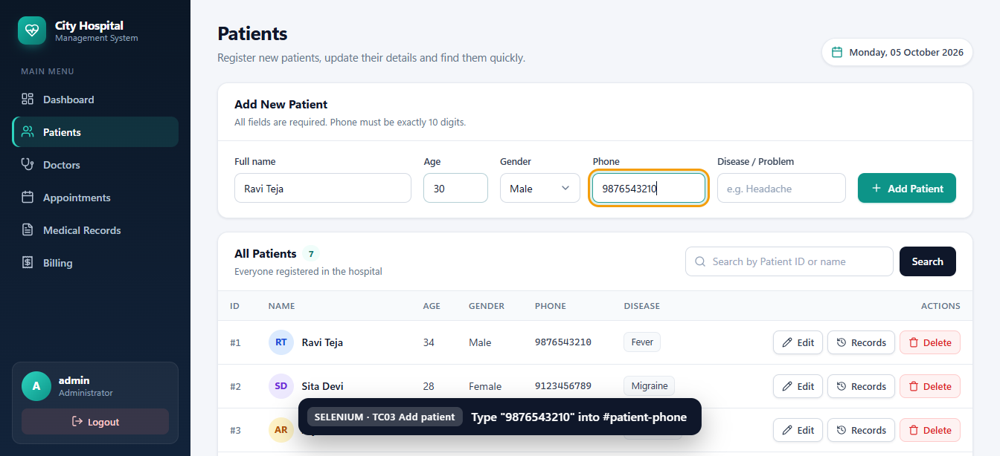
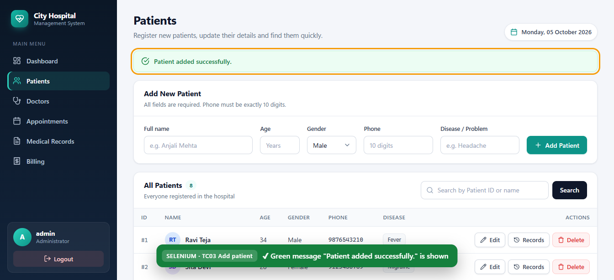
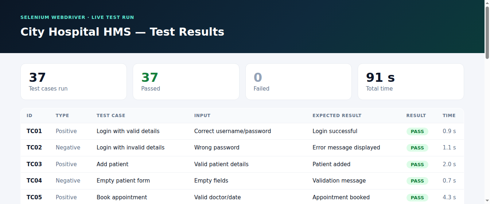

# Hospital Management System – Software Testing using Selenium WebDriver

**M.Tech Software Engineering, SCORE (VIT) · Course: Software Testing**

| Name | Reg No |
|---|---|
| Arun C | 23MIS0445 |
| Sai Chandan K S | 23MIS0115 |

A simple web-based Hospital Management System (HMS), tested automatically with **Selenium WebDriver**.

- Presentation (10 slides, with speaker notes): [`presentation/Hospital_Management_System_Selenium_Testing.pptx`](presentation/Hospital_Management_System_Selenium_Testing.pptx)
- Test report: [`docs/test-report.html`](docs/test-report.html) (open it in a browser)
- Screenshots: [`docs/screenshots/`](docs/screenshots/) (`app/`, `demo/`, `tests/`, `report/`)
- Classroom demo script: [`docs/DEMO_GUIDE.md`](docs/DEMO_GUIDE.md)
- Project document: [`docs/Hospital_Management_System_Selenium_Testing_Project.pdf`](docs/Hospital_Management_System_Selenium_Testing_Project.pdf)
- **Giving the live demo? Start with [section 4](#4-live-demo-step-by-step).**

---

## 1. Modules

| Module | Features |
|---|---|
| Login | Username/password, invalid-login message, logout, pages protected until you log in |
| Patient Management | Add, view, **update**, delete, **search by Patient ID or name** |
| Doctor Management | Add, view, update, search, **Available / Not Available** |
| Appointments | Select patient, doctor, date and time; book or cancel. A doctor **cannot be double-booked** |
| Medical Records | Diagnosis, treatment, prescription; full history for each patient |
| Billing | Consultation charge + treatment charge → **total calculated automatically**; Paid / Unpaid |

Demo login: **admin / admin123**

## 2. How to run (Windows / Mac / Linux)

You need **Python 3.9+** and **Google Chrome**.

```bash
pip install -r requirements.txt
python app.py
```

Open http://127.0.0.1:5000 and log in with `admin` / `admin123`.
Three sample doctors are added automatically the first time you run it. Data is saved in `hospital.db`. To start fresh, run `python run.py --reset` (or delete that file).

## 3. How to run the tests

```bash
# All 122 tests (37 Selenium + 85 PyTest). Chrome opens and runs the UI tests in front of you.
python -m pytest

# Only the Selenium tests
python -m pytest tests/ui

# Slow the Selenium tests down (1.5 s pause after each test)
#   Windows (PowerShell):  $env:DEMO_DELAY="1.5"; python -m pytest tests/ui
#   Mac / Linux:           DEMO_DELAY=1.5 python -m pytest tests/ui

# Generate the HTML test report
python -m pytest --html=docs/test-report.html --self-contained-html
```

You do **not** need the app running for `pytest`: the tests start their own copy of the app with an empty database.
Selenium 4 downloads the correct ChromeDriver automatically.

## 4. Live demo (step by step)

**Full classroom script (what to do and what to say): [docs/DEMO_GUIDE.md](docs/DEMO_GUIDE.md)**

| Command | What it does |
|---|---|
| `python app.py` | Starts our Hospital Management System |
| `python login.py` | First Selenium test: logs in by itself (10 lines of code) |
| `python run.py --step` | Selenium tests all 37 test cases in front of the class, one by one |
| `python report.py` | Runs all 122 tests and opens the HTML test report |

`run.py` lets the class **watch Selenium test the software** on the real running app:

- every element Selenium finds is **highlighted with an orange box**
- a **caption** at the bottom of the page says what Selenium is doing
- the terminal prints every step **and the real Selenium command behind it**, e.g.
  `driver.find_element(By.ID, "patient-name").send_keys("Ravi Teja")`
- every check prints `CHECK PASSED` (or `CHECK FAILED` with a screenshot in `demo_failures/`)
- at the end Chrome shows a **results page** (37 passed / 0 failed)

| Typing into a field | A check passing | Results page |
|---|---|---|
|  |  |  |

```bash
python run.py              # all 37 test cases, presentation speed (about 8 minutes)
python run.py --step       # wait for Enter before each test case (best for explaining)
python run.py TC03 TC11    # only some test cases
python run.py --type negative   # only one type: positive, negative, boundary, edge, security
python run.py --fast       # full speed
python run.py --list       # list the test cases
python run.py --reset      # only empty the app's data (no tests)
python run.py --keep       # keep the data from earlier runs
```

Every `run.py` run **starts with a clean app**: the old patients, doctors, appointments, records and bills
are deleted first and the 3 sample doctors come back, so data never piles up from earlier runs.
(The PyTest tests always use their own new, empty database, so they start clean too.)

## 5. Selenium test cases

37 Selenium test cases. TC01–TC09 are exactly the test cases in our project document.
They are in `tests/ui/test_selenium_hms.py` (fast, for the report) and in `run.py` (slow, for the live demo).

| Type | What it means | Count |
|---|---|---|
| **Positive** | Valid input → the action must succeed | 10 |
| **Negative** | Wrong or missing input → an error must be shown and **nothing saved** | 17 |
| **Boundary / Edge** | Values exactly at or just past a limit (age 0 / 120 / 121, phone 10 / 11 digits, total 0), or unusual but valid cases | 7 |
| **Security** | SQL injection, script injection (XSS), opening pages without logging in | 3 |

| ID | Type | Test Case | Input | Expected Result | Result |
|---|---|---|---|---|---|
| TC01 | Positive | Login with valid details | Correct username/password | Login successful | PASS |
| TC02 | Negative | Login with invalid details | Wrong password | Error message displayed | PASS |
| TC03 | Positive | Add patient | Valid patient details | Patient added | PASS |
| TC04 | Negative | Empty patient form | Empty fields | Validation message | PASS |
| TC05 | Positive | Book appointment | Valid doctor/date | Appointment booked | PASS |
| TC06 | Positive | Search patient | Patient ID | Patient details displayed | PASS |
| TC07 | Positive | Update patient | Modified details | Details updated | PASS |
| TC08 | Positive | Delete patient | Existing patient | Patient removed | PASS |
| TC09 | Positive | Logout | Click Logout | User returned to login page | PASS |
| TC10 | Positive | Doctor availability | Mark doctor unavailable | Shows "Not Available" | PASS |
| TC11 | Negative | Double booking | Same doctor, date and time | Error "already booked" | PASS |
| TC12 | Positive | Medical record | Diagnosis, treatment, prescription | Record saved | PASS |
| TC13 | Positive | Billing total | 500 + 1200 | Total = 1700.00 | PASS |
| TC14 | Negative | Login with wrong username | Username `doctor` | Error message displayed | PASS |
| TC15 | Negative | Login with empty fields | Empty username and password | Error message displayed | PASS |
| TC16 | Security | SQL injection in login | `admin' --` / `' OR '1'='1` | Login refused | PASS |
| TC17 | Security | Page without login | Open `/patients` directly | Sent back to login page | PASS |
| TC18 | Negative | Phone too short | Phone `12345` | Error, patient not saved | PASS |
| TC19 | Boundary | Phone one digit too long | Phone with 11 digits | Error, patient not saved | PASS |
| TC20 | Negative | Name with numbers | Name `Ravi123` | Error, patient not saved | PASS |
| TC21 | Boundary | Age just above the limit | Age 121 | Error, patient not saved | PASS |
| TC22 | Boundary | Age at the limits | Age 0 and age 120 | Both accepted | PASS |
| TC23 | Negative | Search unknown patient | Patient ID 99999 | "No patients found" | PASS |
| TC24 | Negative | Invalid patient update | Phone `123` | Error, old details kept | PASS |
| TC25 | Security | Script injection (XSS) | `<script>alert('hacked')</script>` as disease | Shown as text, script does not run | PASS |
| TC26 | Boundary | Doctor fee 0 | Fee 0 | Error, doctor not saved | PASS |
| TC27 | Negative | Search unknown doctor | `Veterinarian` | "No doctors found" | PASS |
| TC28 | Negative | Appointment in the past | Yesterday's date | Error, not booked | PASS |
| TC29 | Negative | Appointment without patient | No patient selected | Error, not booked | PASS |
| TC30 | Negative | Unavailable doctor | Doctor marked unavailable | Error, not booked | PASS |
| TC31 | Negative | Patient double booking | Same patient, 2 doctors, same time | Error, not booked | PASS |
| TC32 | Edge | Re-book a cancelled slot | Cancel, then book the same slot | Booked again | PASS |
| TC33 | Negative | Record without diagnosis | Empty diagnosis | Error, not saved | PASS |
| TC34 | Negative | Record with future date | Tomorrow's date | Error, not saved | PASS |
| TC35 | Boundary | Bill total 0 | 0 + 0 | Error, not saved | PASS |
| TC36 | Negative | Negative charge | -100 + 500 | Error, not saved | PASS |
| TC37 | Edge | Decimal amounts | 499.50 + 0.25 | Total = 499.75 | PASS |

**Do these tests really catch bugs?** We checked with *mutation testing*: we put 6 bugs into a copy of the app
on purpose (allow age 121, allow 11-digit phones, remove the patient double-booking rule, make the login
vulnerable to SQL injection, allow script injection, allow a bill of 0). Every one was caught by its test
(TC21, TC19, TC31, TC16, TC25, TC35).

Every Selenium test follows the workflow from our document:
**Launch browser → Open HMS → Locate elements → Perform actions → Submit → Verify result → Record result**

Besides Selenium, the project also has 85 PyTest tests at other testing levels:

| File | Level | What it checks |
|---|---|---|
| `tests/test_validators.py` | Unit | Each input rule on its own (phone 10 digits, age 0–120, dates, amounts…) |
| `tests/test_database.py` | Integration | Validation + SQLite database together |
| `tests/test_routes.py` | Functional | HTTP requests to every page, without a browser |
| `tests/ui/test_selenium_hms.py` | System / UI | Real Chrome browser controlled by Selenium |

## 6. Defects found by testing (and fixed)

We also did **exploratory testing**: we tried to break the app on purpose with wrong, strange and dangerous inputs.
These defects were found, fixed, and a **regression test** was added for each one so it can never come back:

| # | Defect found | Severity | Fix |
|---|---|---|---|
| 1 | Typing `nan` as a doctor's fee **crashed the server** (500 error) | High | Numbers must be real, finite numbers |
| 2 | `inf` (infinity) was accepted as a bill amount | Medium | Same fix as #1 |
| 3 | Same patient could be booked with two doctors at the same time | Medium | New business rule + test |
| 4 | Deleting / cancelling / paying something that does not exist still showed "success" | Medium | Shows "not found" error |
| 5 | Database connections were never closed (warnings on Python 3.13) | Medium | Connections closed after every use |
| 6 | A name made only of dots (`..`) was accepted | Low | Name needs at least 2 letters |
| 7 | A 5000-character name was accepted | Low | Max length: name 50, text 200 |
| 8 | Phone accepted non-English digits (`９８７…`) | Low | Only 0-9 allowed |
| 9 | Selenium tests failed randomly about 1 run in 3 (**flaky test**) | Medium | Wait for the page to finish loading, ignoring Chrome's temporary errors |

Checks that **passed** (no defect): HTML/JavaScript injection (XSS) is blocked, SQL injection in login and search is blocked,
past appointment dates and invalid time slots are rejected, and an unknown page shows 404.

## 7. Project structure

```
app.py                  Flask web app: all pages and routes          ->  python app.py
database.py             SQLite database: all create / read / update / delete operations
validators.py           Input validation rules (raise an error message when input is wrong)
login.py                Simple Selenium login test (same as in our document)  ->  python login.py
run.py                  Live Selenium demo: highlights each step, prints PASS / FAIL  ->  python run.py
report.py               Runs all 122 tests and opens the HTML test report     ->  python report.py
requirements.txt        Python packages (pip install -r requirements.txt)
pytest.ini              PyTest settings

templates/              HTML pages (base.html = layout and sidebar, _icons.html = icons)
static/style.css        Styling

tests/
  conftest.py           PyTest setup: fresh test database for every test
  test_validators.py    Unit tests
  test_database.py      Integration tests
  test_routes.py        Functional tests
  ui/conftest.py        Selenium setup: starts the app and opens Chrome
  ui/test_selenium_hms.py  Selenium test cases TC01-TC37

docs/
  DEMO_GUIDE.md         Classroom demo script (what to do and what to say)
  Hospital_Management_System_Selenium_Testing_Project.pdf   Our project document
  test-report.html      HTML test report (pytest-html)
  screenshots/
    app/                The app's pages
    demo/               What the class sees during python run.py
    tests/              Final screen of every Selenium test (saved by PyTest on each run)
    report/             The test report

presentation/           PowerPoint presentation
```

Created while running (not in Git): `hospital.db` (the app's data), `report.html` (from `python report.py`),
`demo_failures/` (screenshots of failed checks in `run.py`).

## 8. Explaining the code (quick guide)

1. **User opens a page** → `app.py` has a function for every URL (`@app.route("/patients")`).
2. **User submits a form** → `app.py` calls `database.py`, e.g. `db.add_patient(...)`.
3. **Before saving**, `database.py` calls `validators.py`. If the phone is not 10 digits, a `ValueError("Phone number must be exactly 10 digits.")` is raised.
4. `app.py` catches the error and shows it in **red**; a success is shown in **green** (`run_action` function).
5. **Selenium** fills the same forms in Chrome, using each element's `id` (e.g. `By.ID, "patient-name"`), and **asserts** that the green or red message and the table show the expected result.

> Note: the example in our document is written in Java (`new ChromeDriver()`, `findElement`, `sendKeys`).
> We used **Python** Selenium. The commands are the same: `webdriver.Chrome()`, `find_element`, `send_keys`, `click`, `quit`.
